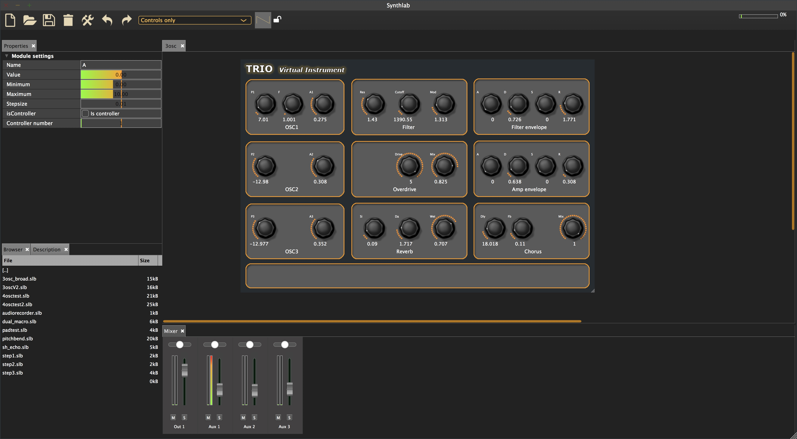
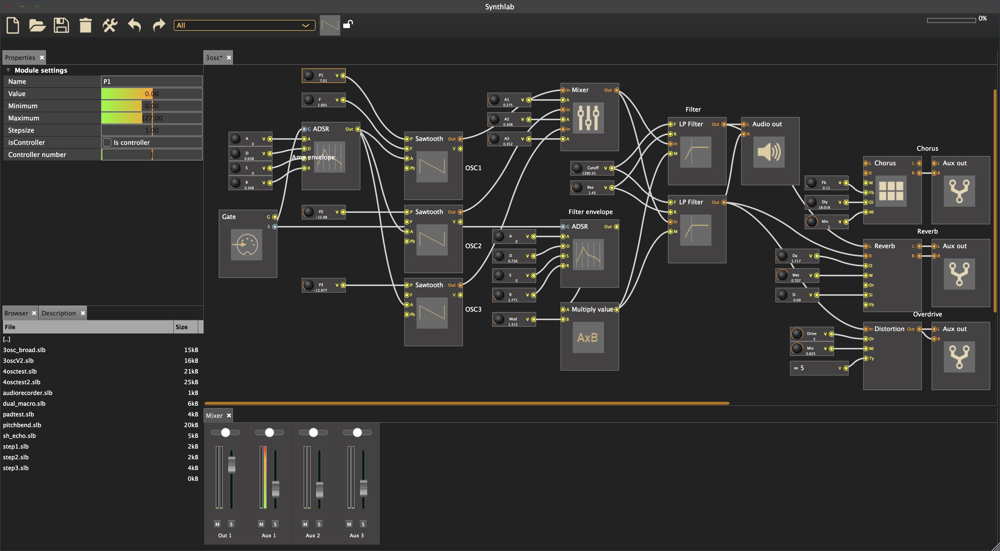
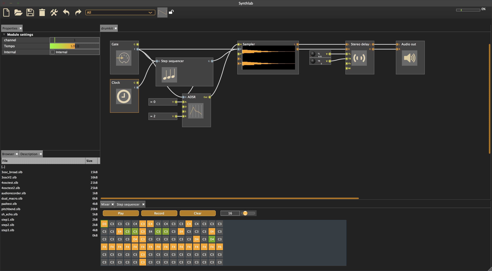
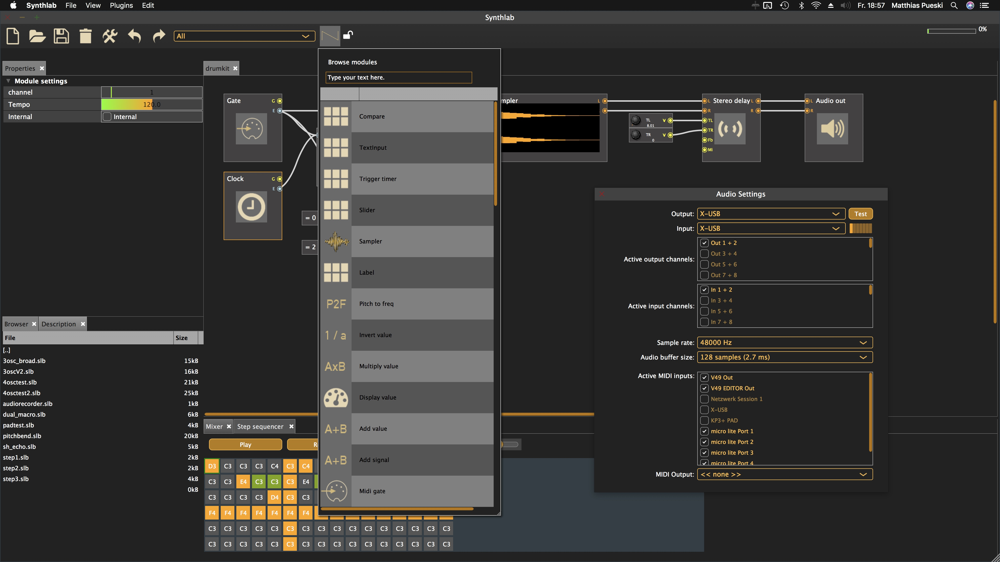

# Synthlab
Modular Synthesizer Studio

Synthlab is in fact a simple Reaktor clone. It allows you to build synthesisers in a graphical manner.

Currenly Synthlab is intended as a standalone application. We probably provide a plugin in the future.

Here's how it looks like:

Synthlab allows complex structures, macros, nesting and much more:

 

Countless variations are possible, so you can end up with a simple sampler, incredible synths and grooveboxes as well:

 

Synthlab provides a convenient module browser, many user controls and sound modules.

 

It currently runs on:

* Windows
* macOS
* iOS

It should also run on Linux and Android, but this has not been tested yet.

It's a JUCE project, so simply go to juce.com and download the framework. 
Then start the projucer and open the project file in order to generate your platform configuration.

# Notice
This is a project at a very early stage but works already good. I currently neither has any docs or tutorials or something.
To get the thing running you can use the projucer. But if you would like to have support you're probably alone an your way.

The samples folder contains a few simple samples though.

But do not hesitate to dig into the code and make Synthlab a better place. ;)

Feel free to contact me for questions.

